# 🔍 Peer Review Simulator

**Simulate structured, multi-perspective peer review feedback for ML/AI research papers.**

Give it a paper (paste text, upload DOCX, or upload PDF), pick a target venue, select reviewer personas, and get back structured scores, detailed comments, a meta-review synthesis, and a downloadable PDF report — all in under a few minutes.

---

## 🎯 Features

| Feature | Description |
|---|---|
| **Multi-format input** | Paste text, upload DOCX, or upload PDF |
| **6 target venues** | ICLR, NeurIPS, ICML, EMNLP, ACL, AAAI |
| **3 reviewer personas** | Prolific Reviewer, Methodology Expert, Constructive Reviewer |
| **5 review dimensions** | Novelty & Significance, Technical Soundness, Clarity & Presentation, Experiments & Baselines, Related Work & Motivation |
| **Structured scores** | 1–10 per dimension with written comments |
| **Meta-review synthesis** | Consensus strengths, weaknesses, disputed aspects, final recommendation |
| **PDF export** | Styled A4 report with cover, score cards, verdicts, meta-review, and individual reviews |
| **LLM auto-detection** | Automatically uses Ollama (local), Anthropic (Claude), or OpenAI (GPT-4o) based on available credentials |

---

## 🏗️ Architecture

```mermaid
%%{ init: { "theme": "dark", "themeVariables": {
  "primaryColor": "#1e3a5f",
  "primaryTextColor": "#e2e8f0",
  "primaryBorderColor": "#22d3ee",
  "lineColor": "#64748b",
  "secondaryColor": "#064e3b",
  "tertiaryColor": "#4c1d95"
} } }%%

flowchart TB
    User(["👤 User<br/><small>Browser</small>"])

    subgraph frontend["🔵 FRONTEND"]
        UI["app/main.py<br/><small>Streamlit UI</small>"]
        Input["Paper Input<br/><small>Paste / DOCX / PDF</small>"]
        Config["app/config.py<br/><small>Venue · Persona · Dimension</small>"]
    end

    subgraph pipeline["🟢 PROCESSING PIPELINE"]
        direction LR
        Loader["app/paper_loader.py<br/><small>python-docx · pdfplumber</small>"]
        Prompts["app/prompts/<br/>system_prompt.py<br/>reviewer_prompts.py<br/>meta_review_prompt.py"]

        subgraph llm["app/llm_client.py"]
            getclient["get_client()"]
            ollama["Ollama<br/><small>localhost:11434</small>"]
            anthropic["Anthropic<br/><small>Claude Sonnet 4</small>"]
            openai["OpenAI<br/><small>GPT-4o</small>"]
        end

        ReviewerEngine["app/reviewer_engine.py<br/><small>generate_review()</small>"]
        MetaReview["app/meta_review.py<br/><small>synthesize_meta_review()</small>"]
        AvgScores["compute_average_scores()"]
        Export["app/export/pdf_export.py<br/><small>reportlab A4 PDF</small>"]
    end

    subgraph outputs["🔵 OUTPUTS"]
        Display["📊 Streamlit UI<br/><small>Score cards · Verdicts · Expander reviews</small>"]
        PDF["📄 PDF Report<br/><small>Cover · Scores · Meta-review · Full reviews</small>"]
    end

    User --> UI
    UI --> Input
    UI --> Config
    Input -->|"paper_text"| Loader
    Loader -->|"paper_text"| ReviewerEngine
    ReviewerEngine -->|"ReviewResult[]"| MetaReview
    ReviewerEngine -->|"ReviewResult[]"| AvgScores
    MetaReview -->|"meta_review"| Export
    AvgScores -->|"avg_scores"| Export
    Prompts -->|"prompt strings"| ReviewerEngine
    Prompts -->|"prompt strings"| MetaReview
    ReviewerEngine -.->|"complete()"| getclient
    MetaReview -.->|"complete()"| getclient
    getclient -.-> ollama
    getclient -.-> anthropic
    getclient -.-> openai
    ReviewerEngine -->|"results"| Display
    MetaReview -->|"meta_review"| Display
    Export -->|"PDF file"| PDF
    PDF -->|"st.download_button"| Display

    classDef fe fill:#0e3a4a,stroke:#22d3ee,stroke-width:2px
    classDef pipe fill:#064e3b,stroke:#34d399,stroke-width:2px
    classDef llmbox fill:#312e81,stroke:#a78bfa,stroke-width:2px
    classDef out fill:#0e3a4a,stroke:#22d3ee,stroke-width:2px
    class UI,Input,Config fe
    class Loader,ReviewerEngine,MetaReview,AvgScores,Export,llm pipe
    class Prompts llmbox
    class Display,PDF out
```



> **Interactive HTML diagram** with full layout available at [`docs/architecture-diagram.html`](docs/architecture-diagram.html) — open in any browser for a detailed labeled version.

### Module Reference

| File | Responsibility |
|---|---|
| `app/main.py` | Streamlit UI — sidebar, tabs, generation button, results display, PDF download |
| `app/config.py` | Venue definitions, persona definitions, review dimension specs |
| `app/llm_client.py` | Shared LLM client — Ollama / Anthropic / OpenAI unified interface (`get_client()`, `parse_json_response()`) |
| `app/paper_loader.py` | Extracts text from DOCX (`python-docx`), PDF (`pdfplumber`), or raw text |
| `app/reviewer_engine.py` | Calls `get_client()` to generate structured reviews, parses JSON responses |
| `app/meta_review.py` | Synthesizes meta-review from multiple `ReviewResult` objects |
| `app/prompts/system_prompt.py` | System prompt defining persona role and JSON output schema |
| `app/prompts/reviewer_prompts.py` | User prompt assembling paper text + venue + persona info |
| `app/prompts/meta_review_prompt.py` | Prompt for synthesizing consensus from multiple reviews |
| `app/export/pdf_export.py` | ReportLab-based PDF generation with styled cover, score cards, and review sections |

---

## 📦 Installation

### Prerequisites

- **Python 3.9+**
- **LLM Provider** (one of):
  - **Ollama** (recommended for testing — no API key, runs locally)
  - **Anthropic API key** (`ANTHROPIC_API_KEY`) for Claude Sonnet 4
  - **OpenAI API key** (`OPENAI_API_KEY`) for GPT-4o

### Quick Install

```bash
# 1. Clone the repo
git clone https://github.com/ydeven757/peer-review-sim.git
cd peer-review-sim

# 2. Install dependencies
pip install -r requirements.txt

# 3a. Option A — Ollama (recommended for testing, no API key needed)
curl -fsSL https://ollama.com/install.sh | sh
ollama pull llama3          # or: mistral, mixtral, qwen2.5, etc.
ollama serve                 # starts server on http://localhost:11434
# App auto-detects Ollama — no env vars needed

# 3b. Option B — Anthropic Claude
export ANTHROPIC_API_KEY='sk-ant-...'

# 3c. Option C — OpenAI GPT-4o
export OPENAI_API_KEY='sk-...'

# 4. Run
./run.sh
```

The app will open at **http://localhost:8501**.

> **Provider priority:** Ollama → Anthropic → OpenAI. The app uses the first
> provider it finds. Set `OLLAMA_BASE_URL` / `OLLAMA_MODEL` to override defaults.

### Dependencies

```
streamlit>=1.28
python-docx>=1.1.0
pdfplumber>=0.11.0
reportlab>=4.0.0
anthropic>=0.20.0
openai>=1.30.0
# No extra dependency needed for Ollama — uses stdlib urllib
```

---

## 🤖 Ollama Setup (Local Testing)

Ollama is the recommended provider for development and testing — no API key needed, fully offline, instant responses.

### Installation

```bash
# macOS / Linux
curl -fsSL https://ollama.com/install.sh | sh

# Windows — download from https://ollama.com/download
```

### Pull a model

```bash
# Lightweight all-rounder (recommended for first run)
ollama pull llama3

# Smaller, faster
ollama pull mistral

# Larger, more capable
ollama pull mixtral

# Code-focused
ollama pull codellama

# Show all available models at https://ollama.com/library
```

### Start the server

```bash
ollama serve
# Server runs at http://localhost:11434
# The app connects automatically — no env vars needed.
```

### Configuration (optional)

```bash
# Override default model (default: llama3)
export OLLAMA_MODEL=mistral

# Use a remote Ollama server
export OLLAMA_BASE_URL=http://your-server:11434/v1

# In app/main.py you could also expose model selection in the sidebar:
#   OLLAMA_MODEL = st.selectbox("Ollama Model", ["llama3", "mistral", "mixtral"])
```

### Which model to use?

| Model | Size | Strengths | Best for |
|---|---|---|---|
| `llama3` | 8B | Well-rounded, good instruction following | General reviews |
| `mistral` | 7B | Fast, strong reasoning | Quick iteration |
| `mixtral` | 8x7B | Expert-level reasoning, SOTA for its size | Detailed reviews |
| `qwen2.5` | 7B | Strong code & technical content | Code-heavy papers |
| `codellama` | 7B | Code generation & explanation | Papers with algorithms |

---

## 🚀 Usage

### Step 1 — Load a Paper

**Option A: Paste text**
Paste the full paper text (or at minimum: abstract + introduction + method + experiments + conclusion) into the text area.

**Option B: Upload a file**
Upload a `.docx` or `.pdf` file. It will be automatically extracted.

### Step 2 — Configure

In the sidebar:

- **Target Venue**: Pick the conference or journal you're aiming for. Each venue has a description and emphasis shown below the selector.
- **Reviewer Personas**: Select 1–3 personas. Each brings a different perspective:
  - *Prolific Reviewer* — broad knowledge, compares to many prior works
  - *Methodology Expert* — deep on technical rigor, mathematical soundness
  - *Constructive Reviewer* — balances praise with actionable improvement suggestions

### Step 3 — Generate

Click **🚀 Generate Reviews**. You'll see:

1. A progress bar as each reviewer persona generates their review
2. A meta-review synthesis step
3. Results displayed inline — score cards, verdicts, expandable individual reviews

### Step 4 — Export PDF

Scroll to the **📥 Export to PDF** section. Optionally edit the paper title, then click **Generate & Download PDF Report**.

---

## 📊 Output Explained

### Dimension Scores (1–10)

Each dimension is scored independently by each reviewer persona:

| Dimension | What it measures |
|---|---|
| **Novelty & Significance** | Originality of contributions, importance of the problem |
| **Technical Soundness** | Mathematical rigor, correctness of claims, logical consistency |
| **Clarity & Presentation** | Writing quality, figure clarity, organization |
| **Experiments & Baselines** | Sufficiency of experiments, quality of baselines, reproducibility |
| **Related Work & Motivation** | Literature coverage, motivation clarity, positioning |

### Reviewer Recommendation

Derived from the average score across all dimensions:

| Average Score | Recommendation |
|---|---|
| > 7.0 | **Accept** |
| 5.0 – 7.0 | **Borderline** |
| < 5.0 | **Reject** |

### Meta-Review

The meta-review synthesizes consensus across all personas:

- **Consensus Strengths** — things all/nearly all reviewers agree are positive
- **Consensus Weaknesses** — recurring criticisms
- **Disputed Aspects** — where reviewers disagreed
- **Final Recommendation** — overall assessment with reasoning

---

## 🔧 Configuration

### Environment Variables

| Variable | Required | Default | Description |
|---|---|---|---|
| `OLLAMA_BASE_URL` | For Ollama | `http://localhost:11434/v1` | Ollama server base URL |
| `OLLAMA_MODEL` | For Ollama | `llama3` | Ollama model to use |
| `ANTHROPIC_API_KEY` | For Anthropic | — | Anthropic API key for Claude Sonnet 4 |
| `OPENAI_API_KEY` | For OpenAI | — | OpenAI API key for GPT-4o |
| `OPENAI_BASE_URL` | For OpenAI proxies | `https://api.openai.com/v1` | OpenAI-compatible base URL |
| `OPENAI_MODEL` | For OpenAI | `gpt-4o` | OpenAI model name |

> **Priority:** Ollama is checked first (no API key needed). Then Anthropic, then OpenAI.

The app auto-detects which key is available. Claude Sonnet 4 is used by default for Anthropic; GPT-4o is used for OpenAI.

### Adjusting LLM Parameters

In `app/reviewer_engine.py` and `app/meta_review.py`, the following parameters can be tuned:

```python
temperature=0.3      # Lower = more deterministic scores
max_tokens=4096      # Increase if reviews are being truncated
```

---

## 🧪 Development

### Running Tests

```bash
# Integration test (loads your DOCX, tests all modules)
cd peer-review-sim
python3 -c "
import sys; sys.path.insert(0, '.')
from app.config import VENUES, PERSONAS, DIMENSIONS
from app.paper_loader import load_paper
from app.reviewer_engine import ReviewResult
from app.meta_review import compute_average_scores
from app.export.pdf_export import export_pdf

print(f'Venues: {len(VENUES)}, Personas: {len(PERSONAS)}, Dims: {len(DIMENSIONS)}')
text = load_paper('path/to/paper.docx', 'docx')
print(f'Extracted: {len(text):,} chars')
r = ReviewResult(persona='Test', summary='', scores={}, strengths=[], weaknesses=[],
                 questions=[], suggestions=[], minor_issues=[], recommendation='Accept', confidence=8)
print(f'Scores: {compute_average_scores([r])}')
print('All OK')
"
```

### Project Structure

```
peer-review-sim/
├── SPEC.md                  # Feature specification
├── README.md                # This file
├── requirements.txt         # Python dependencies
├── .env.example             # API key template
├── run.sh                   # Launcher script
└── app/
    ├── main.py              # Streamlit entry point
    ├── config.py             # Venues, personas, dimensions
    ├── paper_loader.py      # DOCX / PDF / text extraction
    ├── reviewer_engine.py   # LLM integration
    ├── meta_review.py       # Meta-review synthesis
    ├── prompts/
    │   ├── system_prompt.py
    │   ├── reviewer_prompts.py
    │   └── meta_review_prompt.py
    └── export/
        └── pdf_export.py     # ReportLab PDF builder
```

---

## ⚠️ Limitations & Caveats

- **This is a simulation tool** — not an official conference review. Do not submit its output as a real review.
- Reviews are only as good as the paper text provided. Longer, well-structured papers yield better reviews.
- The LLM may occasionally produce malformed JSON (handled with fallback parsing); if a review fails, retry with a slightly longer timeout.
- PDF export uses ReportLab and produces a structured document; it does not render the paper's figures or tables.

---

## 📄 License

MIT — use freely, modify as needed.
